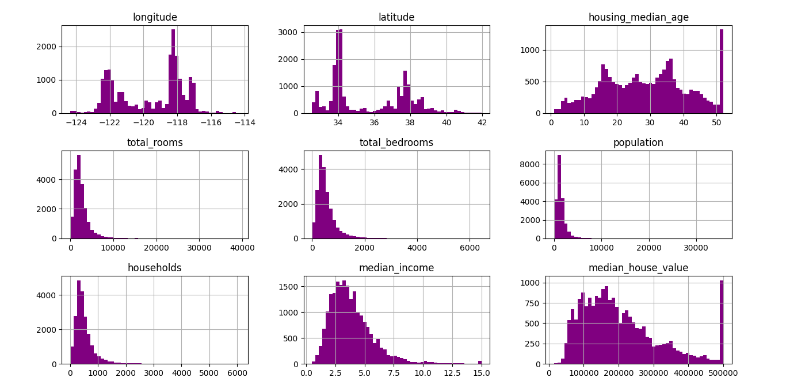
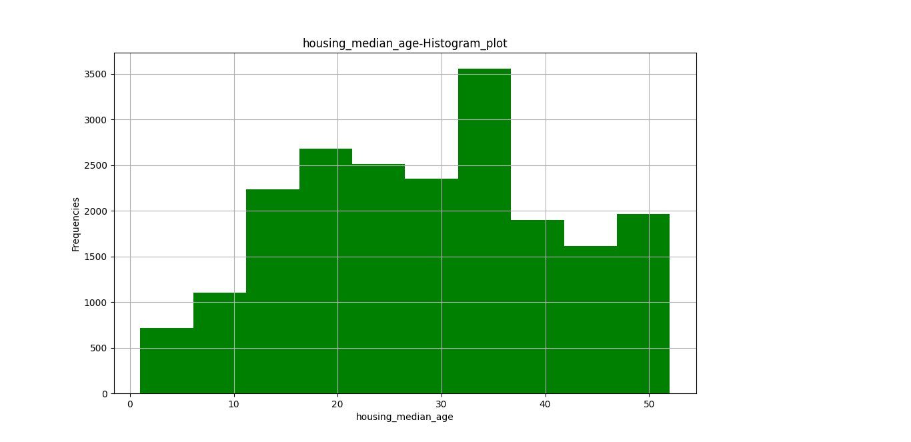

# California_Housing-Data_Analysis
## To predict the median house prices for California.


### INTRODUCTION: 
This dataset gives us a brief description about the california housing data.By analysing this california house dataset we will determine the approximate price for the houses.The main aim of this dataset is to predict the median house prices for california.This dataset consists of the following:

 
#### The dataset contains 20640 entries and 10 variables.

### FEATURES:

**Longitude** (Continuous data): 
- A measure of how far west a house is; a higher value is farther west.

**Latitude**  (Continuous data): 
- A measure of how far north a house is; a higher value is farther north.

**Housing Median Age**  (Continuous data):

- Median age of a house within a block; a lower number is a newer building.

**Total Rooms**  (discrete data):

- Total number of rooms within a block.

**Total Bedrooms**  (discrete data):

- Total number of bedrooms within a block.

**Population**  (discrete data):

- Total number of people residing within a block.

**Households**  (discrete data):

- Total number of households, a group of people residing within a home unit, for a block.

**Median Income**  (Continuous data):

- Median income for households within a block of houses (measured in tens of thousands of US Dollars).

**Median House Value**  (Continuous data):

- Median house value for households within a block (measured in US Dollars).

**Ocean Proximity**  (categorical data i.e.,it is of nominal data type):

- Location of the house w.r.t ocean/sea.

1.What is the average median income of the data set and check the distribution of data using appropriate plots?

```commandline
df['median_income'].mean()

df.hist(bins=50,figsize=(15,15))
plt.show()
```


From the above plot we observe that  the outliers are present for housing_median_age and for median_house_value.
while total_rooms,total_bedrooms,population,households,median_income are of Right skewed.
While latitude and logitude are of asymmetric,i.e.,highly skewed.

2.Draw an appropriate plot for housing_median_age.

```commandline
plt.hist(df['housing_median_age'],color='green')
plt.title('housing_median_age-Histogram_plot')
plt.xlabel('housing_median_age')
plt.ylabel('Frequencies')
plt.grid(True)
plt.show()
```


From the above hist plot we can come to the analysis that it is distributed symmetrically.

we can know the skewness of the above plot by using :Skewed =3*(mean-median)/std()

3.Show with the help of visualization, how median_income and median_house_values are related?

```commandline
sns.scatterplot(x='median_house_value',y='median_income',data=df,color='grey')
plt.show()
```


From the above visualisation it is to be analysed that with an increase in the median_house_value there is also an increase in the median income.While,an outlier is present in median_house_value which is shown in the fig.Therefore,median_house_value is directly proportional to median income.

4.Create a data set by deleting the corresponding examples from the data set for which total_bedrooms are not available.

```commandline
df[df.isnull().any(axis=1)]
new_data=df.dropna(subset=["total_bedrooms"])
print(new_data)

```
While in the above code the missing values are dropped from the column named'total_bedrooms'by using dropna() method

5.Create a data set by filling the missing data with the mean value of the total_bedrooms in the original data set.

```commandline
df['total_bedrooms']=df['total_bedrooms'].fillna(df['total_bedrooms'].mean())
print(df)
```
In the above code,a new dataset had been created where the missing values in the 'total_bedrooms'which are denoted by NaN are replaced with the mean value of the 'total_bedrooms'.

6.Write a programming construct to calculate the median value of the data set wherever required.

```commandline
print(df.head())
print(df['longitude'].median())
print(df['latitude'].median())
print(df['housing_median_age'].median())
print(df['total_rooms'].median())
print(df['total_bedrooms'].median())
print(df['population'].median())
print(df['households'].median())
print(df['median_income'].median())
print(df['median_house_value'].median())

```
7.Plot latitude versus longitude and explain your observations.

```commandline
sns.scatterplot(data=df,x='latitude',y='longitude',color='green')
plt.show()

```


From the above plot,it is to be noted that with an decrease in longitude,latitude is increased.From this point of view,it is to be known that latitude and longitude are not dependent on each other.From this we can say that longitude is inversely proportional to latitude.

From the above plot it is to be noted that latitude vs longitude has negative correlation as here y-axis is increasing while x-axis is decreasing,i.e., both are moving in an opposite direction.

8.Create a data set for which the ocean_proximity is Near ocean.

```commandline
new_data=df.loc[df['ocean_proximity']=='NEAR OCEAN']
print(new_data)
```
9.Find the mean and median of the median income for the data set created in question 8.

```commandline
print(new_data['median_income'].median())
print(new_data['median_income'].mean())
```
10.To create a new column named total_bedroom_size. If size 10 or less. It should be quoted as small. If the size is 11 or more but 1000 less, it should be medium, otherwise it should be large.

```commandline
import numpy as np
conditions= [(df['total_bedrooms']<=10),
             (df['total_bedrooms'] >=11) & (df['total_bedrooms'] <=1000),
             (df['total_bedrooms']>1000)]
values=['small','medium','large']
df['total_bedroom-size']=np.select(conditions,values)
print(df)
```

In the above data set a new column named total_bedroom_size had been added.Where the total_bedroom_size had been compared to the total_bedrooms while mentioning about the sizes of the total_bedroom_size,where:

If the total_bedroom_size <=10 it is indicated as "small"
If the total_bedroom_size >=11 or <=1000 it is indicated as "medium"
If the total_bedroom_size >1000 it is indicated as "large".

11.scatterplot

```commandline
sns.set_style("darkgrid")
sns.scatterplot(x="housing_median_age", y="population", hue="ocean_proximity",
                size="median_house_value", data=df)
plt.xlabel("housing_median_age")
plt.ylabel("population")
plt.title("housing_median_age - population According to ocean_proximity and median_house_value")
plt.show()
```


here we have made a scatter plot.The  hue parameter determines which column in the data frame should be used for colour encoding. 

12.see pairplot for relation between the variables.

```commandline
sns.pairplot(data=df, hue='ocean_proximity')
plt.show()
```


### conclusion:
1.plot between latitude and longitude is inversely proportional to each other as within increase in latitude,there is decrease in longitude.Therefore ,it has a negative correlation.

2.From the given dataset it is to be observed that the outliers are present for housing_median_age and median_house_value.

3.All the features present in this dataset are of float type except ocean_proximity which is of object datatype.


